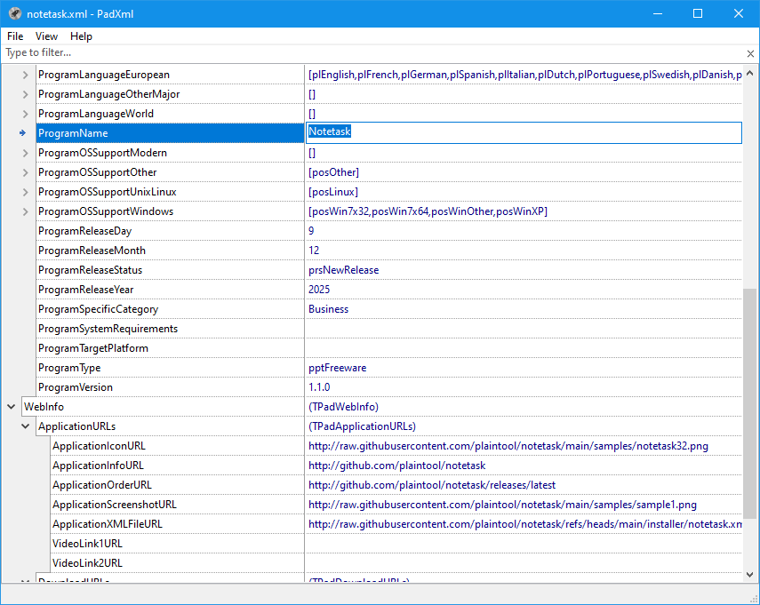

# PadXml

> **⚠️Warning⚠️** `This application is still under development and may contain unfinished features or bugs!`

A lightweight application designed to create, edit, and maintain PAD (Portable Application Description) XML files. PAD files are used to describe software products in a standardized format for software directories, download sites, and application catalogs, helping automate software listing and distribution.

## Installation

### Windows

Several installer options are available on the releases page:

- **tagxml-x64.msi** / **tagxml-x86.msi** — installs the application **for the current user**.  
- **tagxml-x64-allusers.msi** / **tagxml-x86-allusers.msi** — installs the application **for all users on the system**.  

Download the installer from the [releases page](https://github.com/plaintool/padxml/releases), run it, and follow the on-screen instructions. After installation, you can launch Notetask from the Start menu or from the desktop shortcut.

## Donate 💖

If you like this application, you can read how to support it [here](https://plaintool.github.io/notetask/donate.htm).

## Licensing

PadXml is licensed under the MIT License. See the LICENSE file for details.